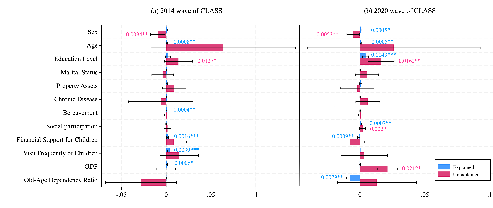

# Decompositions
**社会科学研究中的分解分析方法（Decomposition Methods in Social Sciences）**
---

## 🧭 前言：为什么社会科学研究需要“分解”？

在社会学与人口学研究中，我们经常面临这样的研究问题：

> * 为什么不同国家（或不同时期）的生育率不同？
> * 为什么男性的平均工资高于女性？
> * 为什么收入不平等在上升？哪些因素贡献最大？
> * 为什么模型预测显示某特征更重要？我们能解释它的“贡献”吗？

这些问题的共同核心，是**“差异的归因”**：当两个群体、两段时间或两个模型结果存在差异时，我们希望将总差异**分解**为各个因素的贡献。

本仓库系统介绍我个人使用和了解过的社会科学中几类重要的分解方法，分别代表**人口学 → 劳动经济学 → 机器学习**。其中人口学中的分解方法我只是阅读过相关的研究，并没有真正的使用这种方法写作过相关的论文；我的博士论文是研究老年歧视和不平等，因此Oaxaca- Blinder以及Shapley value decompositions使用过，在这里也提供我的代码。

---

## 👶 一、人口学中的分解方法（Demographic Decomposition）

实际上分解的思想最早是从人口学提出的，人口学的分解方法最早用于解释**人口指标差异的来源**。
最初了解到分解是多年前读到关于生育率分解的文献，从人口学的角度来看，通过对生育率的分解可以发现，主要是生育数量的减少和生育时间的推迟，导致时期总和生育率的下降。

### 2. 经典方法

#### （1）**Kitagawa 分解（1955）**
Kitagawa 是最早的线性分解方法，用于把两个总体率（如TFR、死亡率）差异拆分为“构成差异”和“率差异”两部分。

**适用场景：**
比如你想比较中国和日本的总和生育率（TFR）差异。

> 结果发现：中国的TFR是1.0，日本是1.3，那差0.3到底是为什么？

Kitagawa（1955）提出的方法把这个“总差异”拆成两部分：

1. **结构效应（composition effect）**：
   年龄结构不同造成的。例如，日本30–34岁女性比例高，而这个年龄段是生育高峰，所以整体TFR更高。
2. **率效应（rate effect）**：
   各年龄组的生育率不同造成的。例如，中国每个年龄段的实际生育率比日本低。

她的聪明之处在于：
不偏袒任何一方（不以中国或日本为基准），而是**对两国的平均情况取对称权重**，这样就不会出现“谁当参照结果就不同”的问题。

👉 想象你在算账时，“平均一下两种算法”，保证结果公平、对称。
👉 Oaxaca & Sierminska认为，Kitagawa 分解只是 Oaxaca-Blinder 分解在结果变量为二元变量、所有解释变量均为互斥分类变量时的一个特例，二者的分解框架和技术细节并不相通。但也有学者提议将这一系列的群体差异分解方法统称为“K-O-B”分解方法 。
> - Oaxaca, R. L., & Sierminska, E. (2025). Oaxaca-Blinder meets Kitagawa: What is the link?. PLoS One, 20(5), e0321874.[link](https://journals.plos.org/plosone/article?id=10.1371/journal.pone.0321874)

#### （2）**逐步替代法（Stepwise Replacement, Andreev et al., 2002）**
当指标是非线性的（如预期寿命、健康寿命、教育分层TFR），简单线性分解可能残留交互项。
逐步替代法通过：
1. 依次替换每个因素（如年龄、地区、教育组）；
2. 计算每次替换引起的指标变化；
3. 对所有替换顺序求平均；
   从而实现完全对称的多维分解。

**适用场景：**
当指标更复杂，比如“预期寿命”、“健康寿命”这种**非线性指标**时，简单相加减已经不行。

**直觉理解：**
假设你要比较中国2010年和2020年的平均寿命差了3岁，你想知道：

* 是哪个年龄段的死亡率下降贡献最大？
* 是哪一类死因的改善最关键？

**做法是这样的：**

1. 从2010年的生命表开始。
2. 一步步地，把2010年的参数（死亡率）一个年龄段一个年龄段地替换成2020年的数值；
3. 每替换一次，就看总寿命变化了多少；
4. 最后把每个年龄段“带来的提升”加总起来。

如果你换的顺序不同，结果会有点差异，所以Andreev等人（2002）提出——
👉 **对所有可能的替换顺序求平均**，得到“公正”的分解结果。

这其实就是把Kitagawa的“两步平均”推广成“多步平均”，
换句话说，是一个多维版本的“Shapley 分解”。

 > - Andreev, E. M., Shkolnikov, V. M., & Begun, A. Z. (2002). Algorithm for decomposition of differences between aggregate demographic measures and its application to life expectancies, healthy life expectancies, parity-progression ratios and total fertility rates. Demographic research, 7, 499-522.[Link](https://www.jstor.org/stable/26348070?seq=1)
 > - 

#### （3）**连续变化法（Horiuchi et al., 2008）**
将差异看作参数从群体B连续变为A的过程。
通过积分形式计算各因素的边际贡献，实现**无残差、顺序无关**的分解。
这一方法在理论上等价于**Aumann–Shapley 连续分解**。

**适用场景：**
当你的指标更复杂、维度更多时（例如分地区、分教育、分婚姻状态的生育率），你会希望不再一个个替，而是“连续地”变化。

**直觉理解：**
想象你把2010年的生命表一点点“推”成2020年的生命表，
参数像流动的水一样从旧状态平滑流向新状态。
这时候，你可以通过数学积分，计算出每个小变化在总变化中贡献多少。

**特点：**

* 无残差（完全可加）
* 不依赖替换顺序（顺序无关）
* 理论上等价于“连续版本的Shapley分解”

**一句话理解：**
如果Kitagawa是“平均一下就对称”，Andreev是“多次替换取平均”，
那么Horiuchi就是“无穷小替换取极限”——
它是最优雅、最理论化、也是最精确的分解方法。

> - Horiuchi, S., Wilmoth, J. R., & Pletcher, S. D. (2008). A decomposition method based on a model of continuous change. Demography, 45(4), 785-801. [Link](https://link.springer.com/article/10.1353/dem.0.0033)

#### 🧩 三者的区别与进化关系

| 方法                         | 思路          | 特点         | 适用场景         |
| -------------------------- | ----------- | ---------- | ------------ |
| **Kitagawa (1955)**        | 两个因素、平均处理   | 简单直观、闭式公式  | 年龄结构 × 生育率差异 |
| **逐步替代法 (Andreev, 2002)**  | 多维、逐步替换、求平均 | 无残差、路径公平   | 寿命差异、死因分解    |
| **连续变化法 (Horiuchi, 2008)** | 参数连续变换、积分分解 | 理论最严谨、顺序无关 | 高维指标、多因素分解   |

---

举个生活化的例子来理解,假设你想比较：
> “2010年和2020年，女性的初育年龄为什么提高了3岁？”

| 可能的原因            | 属于哪类效应           |
| ---------------- | ---------------- |
| 年轻人上大学比例高、晚婚多了   | **结构效应**（群体构成变了） |
| 同样年龄的女性也更倾向于推迟生育 | **率效应**（行为模式变了）  |

三种方法在做什么？
* **Kitagawa：** 大概估一下这两类效应各占多少；
* **逐步替代：** 细分到每个年龄或教育组，看哪个组变化最多；
* **连续变化法：** 精确算出每个组、每个细微变化的连续贡献。

#### 🌏 延伸阅读（推荐顺序）

1. Kitagawa, E. M. (1955). *Components of a Difference Between Two Rates.* JASA.
2. Andreev, E., Shkolnikov, V., & Begun, A. (2002). *An Algorithm for Decomposition of Differences in Aggregate Demographic Measures.* *Demographic Research*, 7(14).
3. Horiuchi, S., Wilmoth, J., & Pletcher, S. (2008). *A Decomposition Method Based on a Model of Continuous Change.* *Demography*, 45(4).
4. Das Gupta, P. (1993). *Standardization and Decomposition of Rates: A User’s Manual.*
5. Preston, S., Heuveline, P., & Guillot, M. (2001). *Demography: Measuring and Modeling Population Processes.*

---

## ⚖️ 二、劳动经济学中的分解方法（Inequality & Discrimination Decomposition）

### 1. Oaxaca–Blinder 分解（1973）

Oaxaca 和 Blinder 几乎同时提出了这一方法，用于将两群体（如男性与女性）的平均工资差拆解为两部分：

[
\Delta \bar{W} = (\bar{X}_A - \bar{X}_B)\hat{\beta}_B + \bar{X}_B(\hat{\beta}_A - \hat{\beta}_B)
]

* **解释部分 (Explained)**：特征差异（如教育、经验、行业）
* **不可解释部分 (Unexplained)**：报酬差异（通常解释为歧视）

这一方法成为研究**性别工资差距、教育回报差距**的经典工具。

但它存在：
* **基准依赖问题**：结果依赖于选择哪组系数为“非歧视基准”；
* **只能解释均值差**：无法分解中位数或分布尾部差异。

---

### 2. RIF–Oaxaca–Blinder 分解（Firpo, Fortin & Lemieux, 2009）

为克服以上局限，学者引入了**再中心化影响函数（RIF）**。
RIF 把任意分布统计量（如分位数、Gini 系数）线性化，使其可被回归与分解。

> **思想：**
> 对任意统计量 (v(F_Y))，计算其 RIF：
> [
> RIF(y; v) = v + IF(y; v)
> ]
> 其中 (IF) 是影响函数。对 RIF 进行线性回归，就能像处理均值一样做分解。

因此，RIF–OB 可以解释：

* 不同分位数的工资差距来源；
* 收入不平等的变化（结构 vs 报酬）。

**延伸阅读**

* Oaxaca, R. (1973). *Int. Econ. Rev.* 14(3).
* Blinder, A. (1973). *J. Human Resources.* 8(4).
* Firpo, S., Fortin, N., & Lemieux, T. (2009). *Econometrica*, 77(3).
* Fortin et al. (2011). *Handbook of Labor Economics.*
* 经济学领域还有更多的分解方法和方法的优化思路，详情请见这个[研究综述](./DECOMPOSITION%20METHODS%20IN%20ECONOMICS.pdf)

---

### 3. 我的博士论文中是如何使用RIF-OB分解的
我关注到了老年人的self perception of aging存在城乡和性别差异，于是使用RIF-OB分解分析这种差异的影响因素。RIF-OB分解的好处是除了均值差异之外还可以研究分布差异，因此我的研究主要关注了四种差异：均值差异、方差差异、P90-P10分位数差异、基尼系数差异。
是根据[Jann2024](The%20OB%20in%20Stata%202024%20byBen%20Jann.pdf)、[Andrew2024](./RIF+RIF-OB%202024%20by%20Andrew%20.pdf)的教程，在STATA18中完成的分析，[代码](./RIF-OB%20stata%20do-file.do)。
另外我还对结果进行了可视化，可以得到一个更直观的对比图，[绘制代码](./visualization%20code%20of%20RIF-OB%20STATA%20do-file.do)在此分享。

---

## 🧮 三、Shapley 与 SHAP：分解的博弈论根源与机器学习拓展

### 1. Shapley 值（1953）

Shapley 在博弈论中提出了一种**公平分摊法则**：
给定一个合作博弈，Shapley 值衡量每个参与者对总收益的平均边际贡献。

在人口学、经济学中，**Shapley 分解**成为一种统一的分配思想：

* 对所有因素排列顺序求平均；
* 各因素贡献之和等于总体差异；
* 结果不依赖于变量顺序，无残差。

事实上：

> Kitagawa、逐步替代法、Horiuchi 连续变化法，
> 都是 Shapley 分解在不同条件下的特例。

---

### 2. SHAP（SHapley Additive exPlanations）

在机器学习领域，[Lundberg & Lee (2017)](https://proceedings.neurips.cc/paper/2017/hash/8a20a8621978632d76c43dfd28b67767-Abstract.html) 将 Shapley 值思想引入模型解释：

* 把模型预测看作“博弈总收益”，
* 各特征是“参与者”，
* 计算每个特征的平均边际贡献。

结果：
[
f(x) = \phi_0 + \sum_j \phi_j
]

* (\phi_0)：基准输出（平均预测）
* (\phi_j)：特征 (j) 对预测的 Shapley 贡献

关于想要学习和使用，我在kaggle上找到一个不错的学习和练习的教程：[Advanced Uses of SHAP Values](https://www.kaggle.com/code/dansbecker/advanced-uses-of-shap-values)

**延伸阅读**

* Shapley, L. (1953). *A Value for N-Person Games.*
* Lundberg, S. & Lee, S. (2017). *A Unified Approach to Interpreting Model Predictions.* NeurIPS.
* Molnar, C. (2022). *Interpretable Machine Learning.*

### 3. 我的博士论文中的Shapley value decomposition
中国经济社会发展存在显著的区域差异，大致可以分为四个区域，在我的博士论文关注到了这种区域差异，并通过shapley值分解来研究不同区域影响因素的贡献值。这个部分本来是想使用STATA进行分析的，但是STATA中能分解的因素有数量限制，因此使用了python中的SHAP包，[代码](./shapley-region.ipynb)

---

## 📚 推荐阅读与工具

* Das Gupta, P. (1993). *Standardization and Decomposition of Rates: A User’s Manual.*
* Preston, S. et al. (2001). *Demography: Measuring and Modeling Population Processes.*
* Fortin, Lemieux, & Firpo (2011). *Decomposition Methods in Economics.*
* Shorrocks, A. (2013). *Decomposition Procedures for Distributional Analysis.*
* Molnar, C. (2022). *Interpretable Machine Learning.*

---